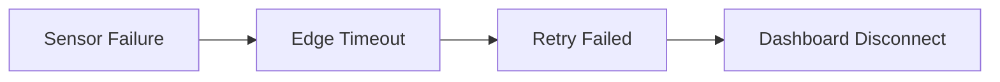
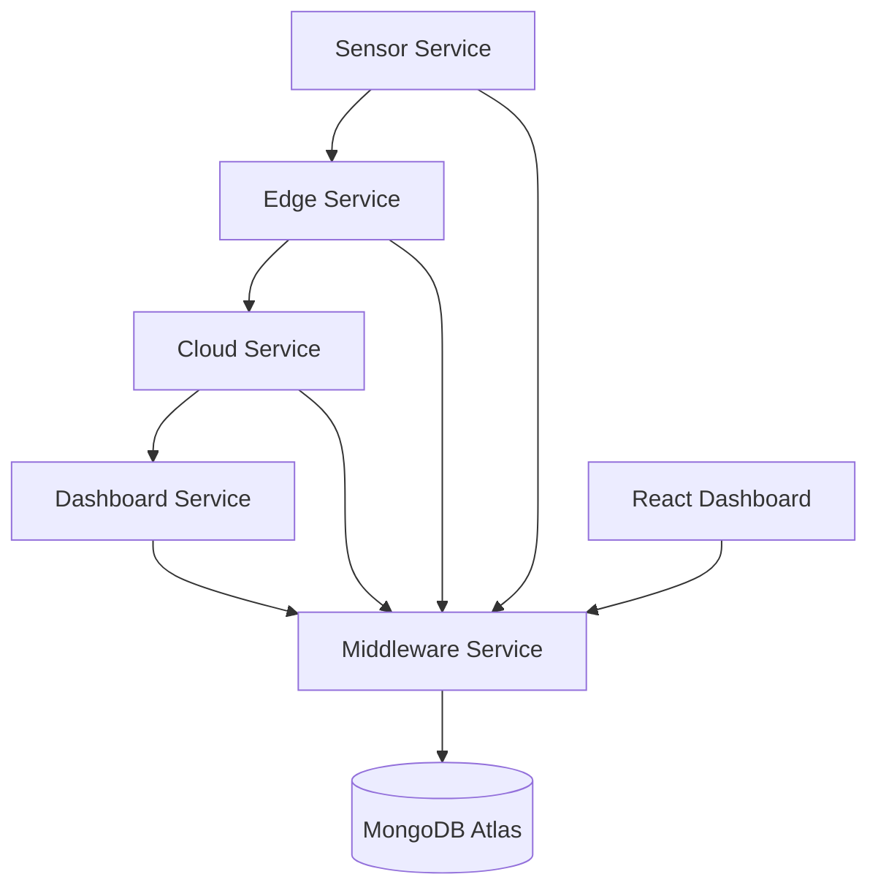

<div align="center">

# 🚀 DevPulse

### Distributed Observability & Root Cause Analysis Platform

Track failures. Reconstruct traces. Find root causes.


</div>

---

## 🎯 What is DevPulse?

DevPulse is a distributed observability platform built to simulate and analyze cascading failures across microservices.

Instead of investigating hundreds of disconnected logs, DevPulse reconstructs the entire failure journey and identifies the original root cause.

---

## ⚡ Failure Flow



---

## 🏗️ System Architecture



---

## ✨ Features

✅ Distributed Event Simulation

✅ Trace Propagation

✅ Root Cause Analysis

✅ Failure Chain Reconstruction

✅ Dockerized Architecture

✅ React Investigation Dashboard

✅ Prometheus Metrics

---

## 🛠️ Tech Stack

| Layer | Technology |
|---------|---------|
| Frontend | React + Vite |
| Backend | Node.js + Express |
| Database | MongoDB Atlas |
| Containerization | Docker + Docker Compose |
| Monitoring | Prometheus |
| Architecture | Distributed Systems |

---

## 📸 Dashboard


```text
---

## 🚀 Quick Start

```bash
git clone https://github.com/YOUR_USERNAME/DevPulse.git

cd DevPulse

docker compose up --build
```

---

## 📡 APIs

```http
POST /api/logs

GET /api/events

GET /api/traces/:traceId

GET /api/root-cause/:traceId

GET /metrics
```

---

## 🔭 Roadmap

- [x] Distributed Event Simulation
- [x] Root Cause Engine
- [x] React Dashboard
- [x] Dockerization
- [x] Prometheus Metrics
- [ ] Grafana Dashboards
- [ ] OpenTelemetry
- [ ] AWS Deployment
- [ ] Real-Time Alerting

---

<div align="center">

Built to explore Distributed Systems, Observability, and DevOps concepts 🚀

</div>
